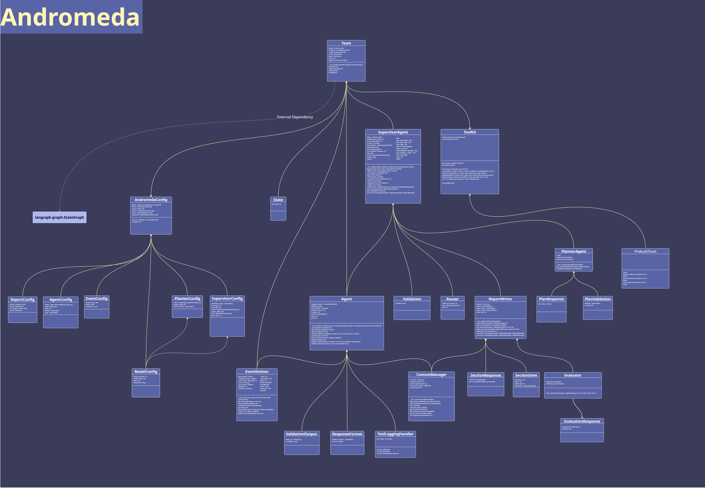

Architecture
============
Andromeda' architecture is designed to be modular and extensible, allowing for flexible integration of various components to support complex research workflows. Below is an overview of the key components and their interactions.

Components Overview
-------------------

**Agents**

- Specialized AI agents that perform specific tasks such as data analysis, information retrieval, and report generation.
- Each agent can be configured with specific tools and roles to suit the research needs.

**Team**

- A collection of agents working collaboratively to solve a research or analysis task.
- Manages agent assignment, task distribution, and coordination among agents.

**Planner**

- Responsible for decomposing the main research task into actionable steps.
- Generates a plan that outlines which agents should perform which subtasks and in what order.

**Supervisor**

- Oversees the execution of the plan and validates the outputs of each agent.
- Ensures that the workflow adheres to quality standards and that all required citations and references are included.
- Can reassign or reroute tasks if necessary.

**Tools**

- External utilities and APIs (such as web search, news retrieval, or custom data sources) that agents use to gather information.
- Tools can be easily integrated or swapped out to extend agent capabilities.

**ReportWriter**

- Aggregates findings from all agents and generates a structured, citation-rich report.
- Handles section planning, summarization, citation extraction, and formatting.

**Context Manager**

- Manages the conversation and research context, including summarizing long histories and ensuring relevant information is available to agents within token limits.

**Config & Utilities**

- Configuration files and utility modules that define agent roles, toolsets, prompt templates, and logging.
- Facilitate customization and extension of the framework.

Detailed Component Architecture
-------------------------------

**Team (Main Orchestrator)**

- Entry point for all operations
- Manages the complete workflow: Planning → Supervision → Reporting
- Handles configuration, initialization, and execution lifecycle
- Supports both synchronous (``begin()``) and asynchronous (``abegin()``) execution

**Agent Types**

- **ReAct Agents**: Use reasoning and acting pattern for structured tasks
- **CodeAct Agents**: Include code execution capabilities for analytical tasks
- Each agent has configurable tools, prompts, validation rules, and citation requirements
- Agents maintain conversation memory and support streaming responses

**Supervisor Agent**

- Routes tasks to appropriate specialized agents based on capabilities
- Manages task planning and validation through dynamic tool creation
- Supports recursive feedback loops for quality improvement
- Tracks plan execution and marks completed items

**Planner Agent**

- Generates detailed, structured action plans using language models
- Validates plan feasibility and completeness
- Supports iterative refinement with feedback loops
- Integrates agent capabilities into planning process

**Workflow System**

- **Declarative Workflows**: Fluent API with method chaining (``.start()``, ``.then()``, ``.run()``, etc.)
- **Operator Overloaded Workflows**: Functional composition using ``>>`` operator and decorators
- State management with automatic merging and validation
- Support for conditional routing and parallel execution
- Built on LangGraph for robust state handling
- Expression-based workflow construction with ``WorkflowExpression``

**Tools System**

- **Search Tools**: Internet search, news articles, web scraping
- **Context Management**: Automatic deduplication and result caching
- **Citation Tracking**: Source management with automatic formatting
- **Extensible Design**: Easy to add custom tools and integrations

**Report Writer**

- Multi-stage report generation: Summarization → Section Planning → Content Writing
- Automatic citation extraction and formatting
- Token-aware context management for large documents
- Support for multiple output formats and validation

Interaction Flow
----------------

**Phase 1: Initialization**

1. User creates ``AndromedaConfig`` with agent and tool configurations
2. Team initializes all components (agents, supervisor, planner, report writer)
3. Workflow graph is built and compiled for execution

**Phase 2: Planning**

1. Planner analyzes the research task and available agent capabilities
2. Generates structured plan with specific, actionable steps
3. Supervisor validates plan feasibility and completeness
4. Plan is refined iteratively until all requirements are met

**Phase 3: Execution**

1. Supervisor routes tasks to appropriate agents based on expertise
2. Agents execute tasks using configured tools and capabilities
3. Results are validated for quality and completeness
4. Supervisor coordinates between agents and manages dependencies

**Phase 4: Reporting**

1. Report writer summarizes conversation history and findings
2. Generates structured sections with proper citations
3. Applies formatting and validates output quality
4. Produces final research report in specified format

**Phase 5: Quality Control**

- Multi-layer validation at each step
- Automatic retry and rerouting on failures
- Citation verification and source tracking
- Context management for token limits

Key Features
------------

**Hierarchical Management**: Supervisor-worker model with intelligent task distribution
**Quality Control**: Multiple validation layers with configurable thresholds
**Citation Management**: Automatic source tracking and standardized formatting
**Context Management**: Smart token limit handling and conversation summarization
**Flexible Architecture**: Plugin-based tool system and configurable agent types
**Dual Workflow Patterns**: Declarative and operator-overloaded workflow construction
**Streaming Support**: Real-time results for interactive applications
**Error Handling**: Robust retry mechanisms and graceful failure handling

This architecture provides a solid foundation for complex research workflows while maintaining flexibility and extensibility for diverse use cases.
